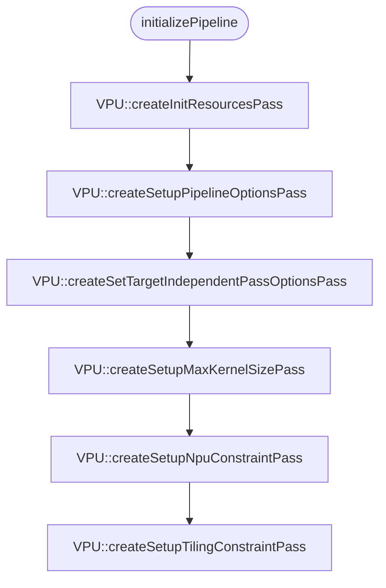
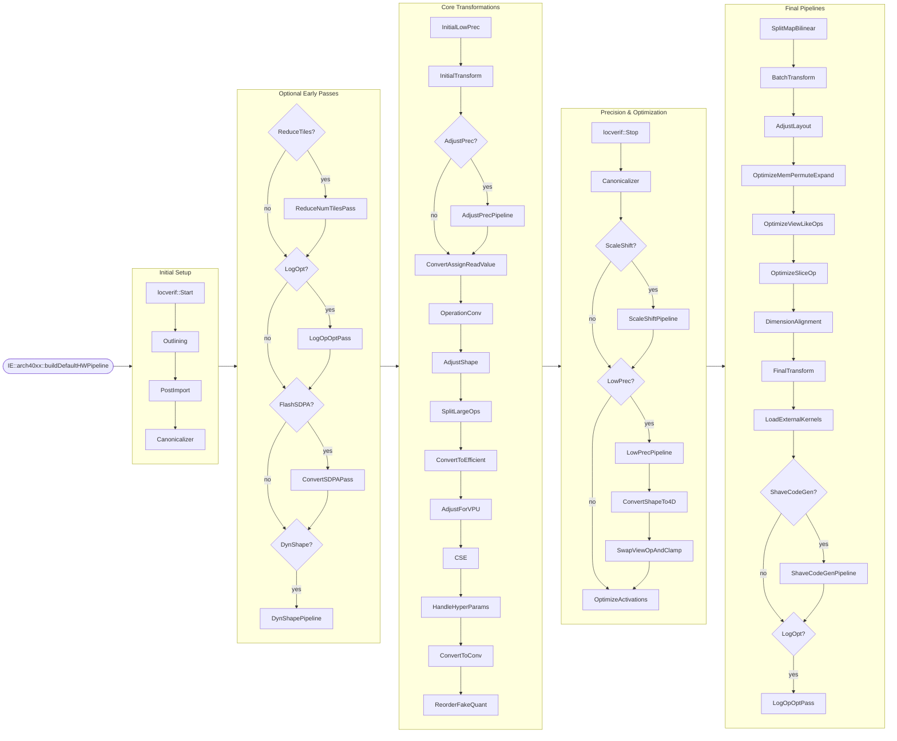
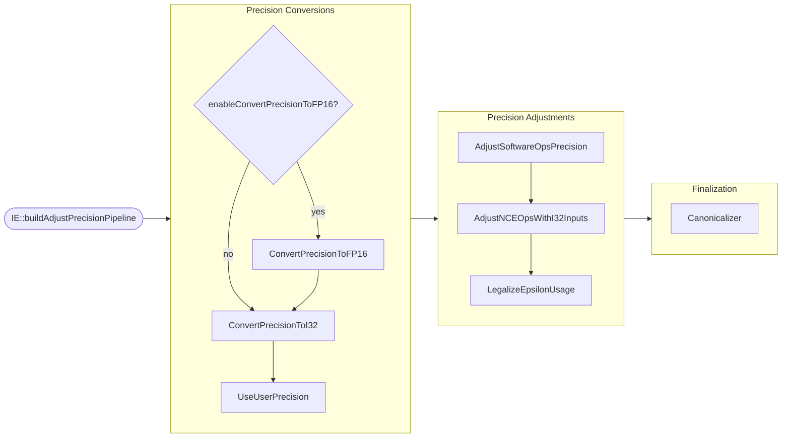
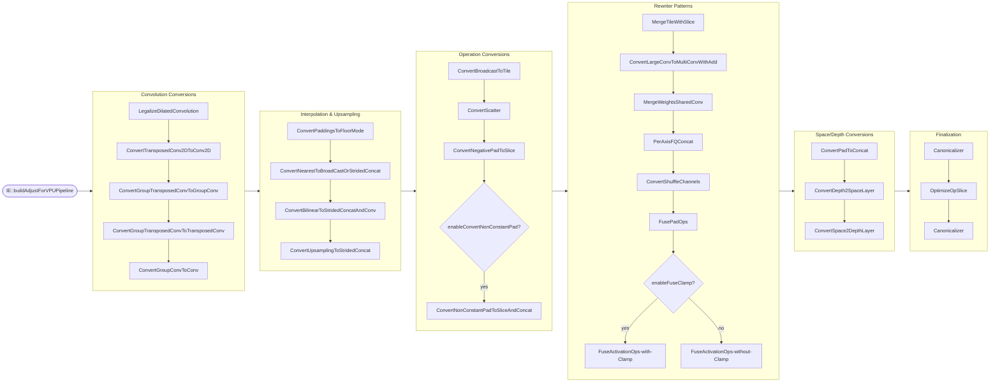
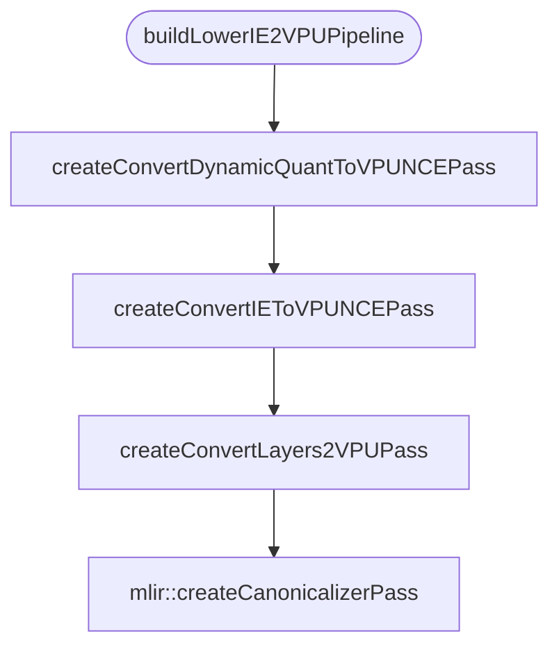
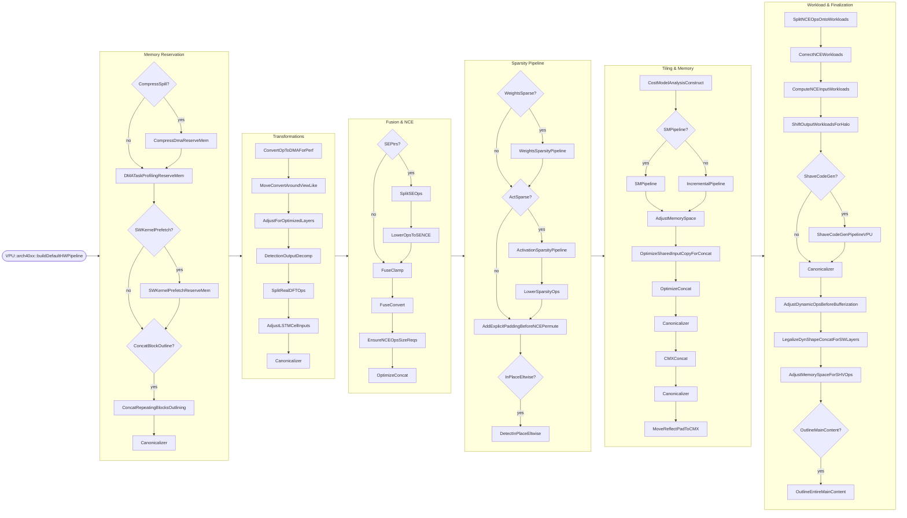
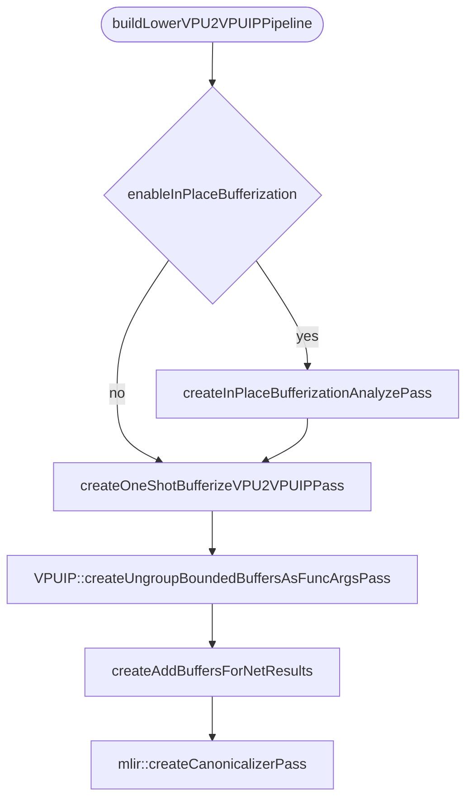
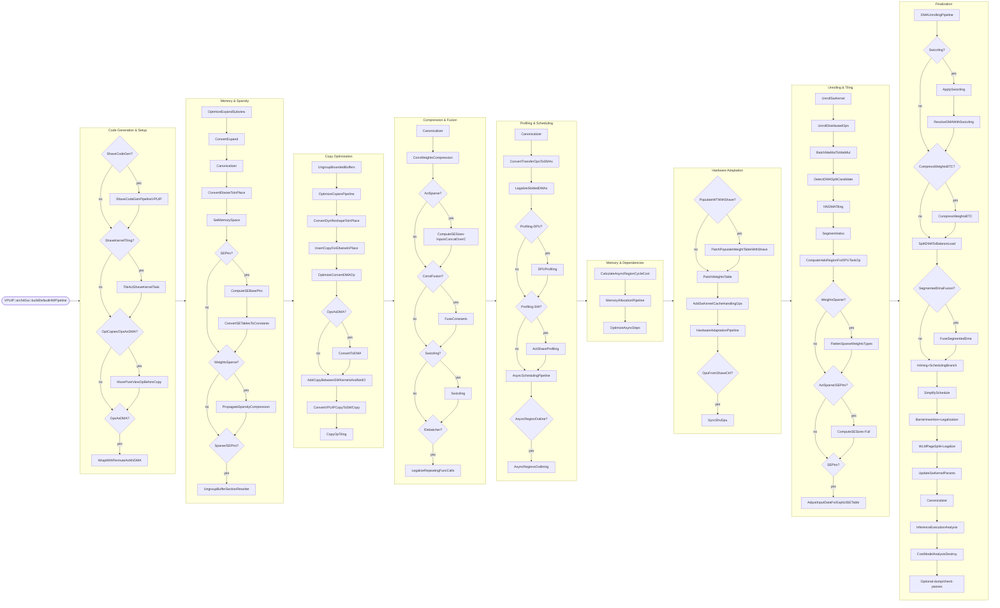

# NPU Compilation Pipelines

This document provides a high-level overview of the compilation pipelines implemented in the NPU MLIR-based compiler.

The compiler executes a sequence of transformations, structured as distinct pipelines, which lower the high-level representation (typically OpenVINO operations) down to hardware-specific execution models and finally to ELF binaries. The compiler provides several high-level compilation pipelines that are chosen based on the targeted architecture and the execution mode.

## High-Level Compilation Pipelines

The compiler supports different compilation mapping strategies directly related to how workloads are deployed onto the NPU (Neural Processing Unit) or the host. These top-level pipelines act as the primary entry points configuring the pass managers based on hardware targets.

### 1. DefaultHW
The `DefaultHW` pipeline is the standard compilation path tailored to the hardware layout of the target NPU. It expects execution to leverage hardware DMA sequences, SHAVEs, and DPUs. This pipeline aggressively optimizes the model for accelerator resources.

### 2. ReferenceSW
The `ReferenceSW` pipeline is primarily designed for reference and testing purposes. Instead of mapping operations to full hardware execution pathways, it usually lowers operators into software execution kernels.

### 3. HostCompile
The `HostCompile` pipeline introduces an intricate multi-layered approach to handle host/accelerator coordination seamlessly. This pipeline is used for models that interact heavily with Host application, frequently involving dynamic shapes operations.

## Compilation Phases

Both `DefaultHW` and `ReferenceSW` compilation modes follow a structured progression of dialect-level optimizations and lowerings:

### 1. IE Pipeline (Inference Engine)
* **Goal**: High-level, HW-agnostic optimization.
* **Operations**: Operates on the **IE** dialect.
* **Details**: Performs standard optimizations like constant folding, canonicalizations, layout propagation, and dimension reshaping that are largely independent of the final VPU hardware version.

### 2. Lower IE to VPU Pipeline
* **Goal**: Hardware-aware operation conversion.
* **Operations**: Converts `IE` dialect forms into `VPU` dialect representation.
* **Details**: Translates the generalized high-level operations into hardware-specific `VPU` variants (e.g., `VPU.NCE.Convolution`).

### 3. VPU Pipeline (VPU Dialect Optimizations)
* **Goal**: Target-specific resource binding and scheduling.
* **Operations**: Operates on the **VPU** dialect.
* **Details**: In this pipeline, the compiler performs complex hardware analyses such as bounding the model to physical memory hierarchies, tiling, hardware layout constraints, and sparsity configuration.

### 4. Lower VPU to VPUIP Pipeline
* **Goal**: Translating logical operations to explicit tasks.
* **Operations**: Lowers `VPU` dialect into `VPUIP` dialect.
* **Details**: Lowers operational forms into explicitly dispatched tasks, handling execution boundaries between hardware components (DPUs/SHAVEs) and managing memory transitions explicitly.

### 5. VPUIP Pipeline
* **Goal**: Final layout, graph execution, and task scheduling.
* **Operations**: Operates on the lowest level MLIR optimization run, `VPUIP`.
* **Details**: Schedules asynchronous executions, DMA optimization, explicit scratchpad memory allocations, barrier scheduling, and detailed hardware scheduling, before finally emitting executable binaries (ELF format).

## DefaultHW pass flow (split by stage)

The diagrams below show the `DefaultHW` pass flow split into 6 stages for easier rendering and review.

> Scope: `NPU40XX` `DefaultHW` path (`DefaultHwStrategy` + `DialectPipelineStrategy40XX`).

### Stage 1: Initialize pipeline

### Stage 2: IE pipeline

#### AdjustPrecisionPipeline

#### AdjustForVPUPipeline

### Stage 3: Lower IE to VPU

### Stage 4: VPU pipeline

### Stage 5: Lower VPU to VPUIP

### Stage 6: VPUIP pipeline

## The HostCompile Variant

In the `HostCompile` variant, the pipeline flow is wrapped to handle coordination:
1. **Host Pre-processing**: Uses utilities to outline shape predictions, generating a nested `@NPU` module for strict NPU execution while keeping control logic outside.
2. **Inner NPU Pipeline**: Runs the standard IE -> VPU sequence inside the nested `@NPU` module.
3. **Host Interleaving**: Unpacks the module and runs host-specific utility passes (handling memory copies, scratch buffer generation, and function call wrappings).
4. **Final Lowering**: Continues the `VPUIP` transition uniformly over the host and accelerator boundaries.
